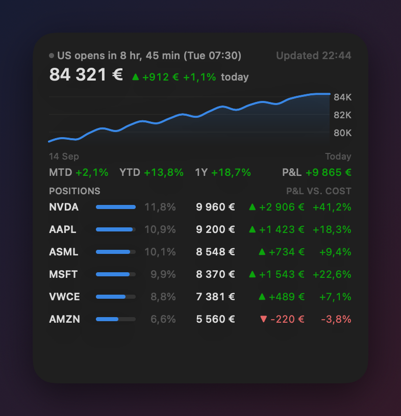
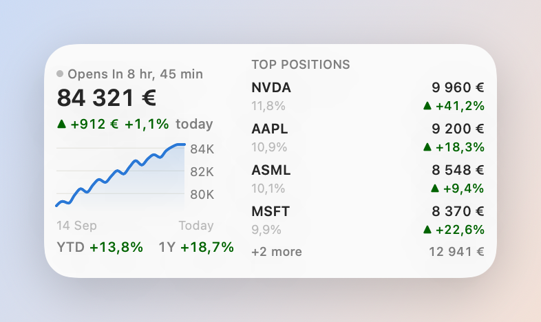
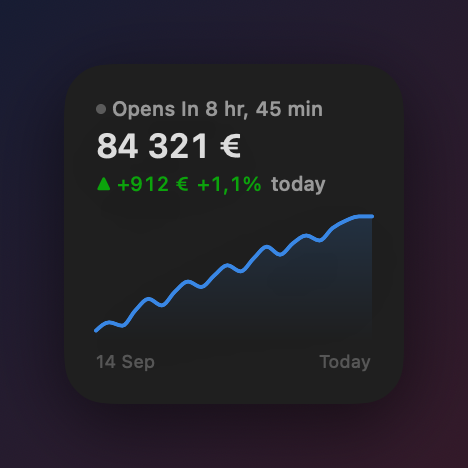

# Folio

<p align="center">
  
</p>
<p align="center">
  
  
</p>
<p align="center"><sub>Rendered with sample data.</sub></p>

A macOS desktop widget for your Interactive Brokers portfolio: account value, today's change, returns and positions, straight from IBKR's Web API. No gateway, no browser login, no server in between.

- **Widget sizes**: small (value and 1-month chart), medium (adds YTD/1Y and top positions), large (adds MTD, unrealized P&L and all positions with weight bars), extra large (two-column).
- **Market status**: `US opens in 12 hr, 50 min (Tue 07:30)` in your local time, flipping exactly at open and close. US and Xetra holidays built in.
- **Read-only by design**: Folio only calls portfolio and performance endpoints and never opens a brokerage session, so TWS, Client Portal and the mobile app stay logged in.
- **Nothing leaves your Mac** except signed requests to `api.ibkr.com`. No telemetry, no third-party services.
- **A small menu bar app** does the polling (every 1, 5 or 15 minutes) and feeds the widget. Credentials live in the macOS Keychain.

> Not affiliated with or endorsed by Interactive Brokers. IBKR is a trademark of Interactive Brokers LLC.

## Requirements

- macOS 14 or later, Xcode 15 or later, an Apple ID that can sign apps (a free account works for running locally).
- An IBKR account with **OAuth 1.0a** access through IBKR's self-service portal. IBKR describes OAuth 1.0a as aimed at institutional use and retail accounts are normally expected to use the Client Portal Gateway, so availability varies. If the portal link below works for you, you are set.

## Install

Download `Folio-x.y.z.zip` from the [latest release](https://github.com/usatenko/folio/releases/latest), unzip, move `Folio.app` to `/Applications` and open it. Releases are signed with a Developer ID and notarized by Apple, so macOS opens them without warnings. Folio has no updater; check the releases page now and then.

Or build it yourself:

## Build

```bash
brew install xcodegen
git clone https://github.com/usatenko/folio.git && cd folio
DEVELOPMENT_TEAM=XXXXXXXXXX xcodegen generate      # your 10-character Apple team ID
xcodebuild -project IBKRWidget.xcodeproj -scheme IBKRWidget -configuration Release -derivedDataPath build build
cp -R build/Build/Products/Release/Folio.app ~/Applications/
open ~/Applications/Folio.app
```

Or open the generated project in Xcode and run the `IBKRWidget` scheme. The team ID is in Xcode → Settings → Accounts, or on developer.apple.com under Membership.

## Set up IBKR credentials

1. Generate keys on your Mac (keep the private files safe, they are never uploaded):
   ```bash
   mkdir -p ~/.ibkr && cd ~/.ibkr
   openssl genrsa -out signature.pem 2048 && openssl rsa -in signature.pem -pubout -out signature.pub.pem
   openssl genrsa -out encryption.pem 2048 && openssl rsa -in encryption.pem -pubout -out encryption.pub.pem
   openssl dhparam -out dhparam.pem 2048
   ```
2. Open the [IBKR OAuth self-service portal](https://ndcdyn.interactivebrokers.com/sso/Login?action=OAUTH&RL=1), log in with your live username, choose a consumer key (9 uppercase letters) and upload `signature.pub.pem`, `encryption.pub.pem` and `dhparam.pem`.
3. Generate an access token; the portal shows the token and its secret once.
4. In Folio → Settings, paste the consumer key, token and secret, choose the two private `.pem` files and `dhparam.pem`, click **Test connection**, then **Save**. Everything is stored in your login Keychain; the files on disk are no longer needed by the app.

New consumer keys and tokens can take until IBKR's next overnight reset before they work. The Settings window has the same steps with a copy button for the commands.

Then right-click the desktop → **Edit Widgets** → **Folio**.

## How it works

`App/IBKRClient.swift` implements IBKR's OAuth 1.0a flow in Swift: the access-token secret is decrypted with your RSA encryption key, a Diffie-Hellman exchange (your `dhparam.pem` prime, [BigInt](https://github.com/attaswift/BigInt) for the arithmetic) produces a live session token, and every request is signed with HMAC-SHA256 over that token. RSA goes through Apple's Security framework, HMAC through CryptoKit. It is a port of the flow in [ibind](https://github.com/Voyz/ibind).

Each poll makes five read-only calls: `portfolio/accounts`, `summary`, `ledger`, `positions` and `pa/allperiods`. The result is written to the app group container, where the widget extension reads it. The widget itself has no network or Keychain access.

## Security notes

- Sandboxed, hardened runtime, no debugger entitlement in release builds.
- Credentials are one Keychain item. On builds signed with a provisioning profile they go into the data-protection keychain (bound to the app, no "Allow" prompts); otherwise into the login keychain.
- The access token has whatever rights IBKR grants it, and IBKR does not offer read-only tokens. Folio only ever reads, but anyone who extracts the Keychain item could do more. Treat your Mac login accordingly (FileVault, a locked screen).
- Nothing is logged. Error messages shown in Settings may include IBKR's response text, which can contain your account id.

## Limitations

- WidgetKit refreshes widgets at most about every 15 minutes; Folio asks for a reload after each poll, but macOS decides.
- No per-position price history or day change: IBKR only serves price data to a brokerage session, which Folio deliberately never opens. Position P&L is unrealized P&L versus average cost.
- Market holidays are listed for US and Xetra through 2027; other markets skip weekends only. Early-close days count as full days.
- One account: the first account the API returns.

## Releasing (maintainers)

Two ways, both producing a Developer ID-signed, notarized `Folio-X.Y.Z.zip` on the releases page:

- **On your Mac** (the certificate never leaves your keychain): `scripts/release.sh 1.0.0`. One-time setup is described at the top of the script.
- **On GitHub Actions**: run the *Release* workflow manually from the Actions tab with the version number. It needs six secrets, listed at the top of `.github/workflows/release.yml`; keep them in a protected `release` environment rather than as plain repository secrets.

Every push also runs an unsigned CI build.

## License

MIT, see `LICENSE`.
